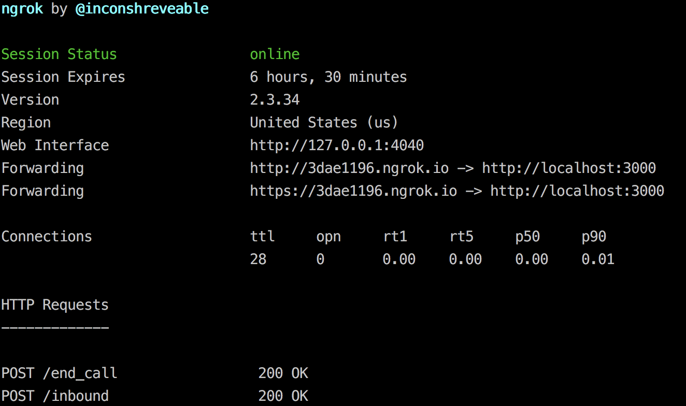

# coc-hotline
The [PromptConf](http://promptconf.com) Code of Conduct Hotline

# Requirements
Python 3.6+ as well as a Twilio number

# Attributions
This hotline reuses the setup from the PyCascades Code of Conduct hotline created by @mariatta and @cache-rules;
two amazing Pythonistas that are truly committed to building a safe and inclusive environment in all of tech. You all
rock, thanks for making this hotline so easy to setup!

Directions below are taken from their [project README](https://github.com/cache-rules/coc-hotline).
 
# How it works
When the hotline is called, it will ring the phones listed in the `COC_NUMBERS` env variable.
The caller will be connected to the first person who responds.

# Twilio Setup
You'll need to get Twilio voice number and configure your voice number to use this hotline. Specifically you will need
to setup the Webhook for receiving inbound calls and a Webhook for receiving inbound SMS messages.

# Installation
1. Create and activate a virtual environment.
2. Run `pip install -r requirements.txt` to install the dependencies
3. (Optional) Add the "Incoming Webhooks" integration to your slack team of choice
    * Follow the configuration instructions and write down your WebHook URL
4. Set the following environment variables:
    * `COC_NUMBERS`: A comma separated list of phone numbers prefixed with `+`, numbers should include country code.
    * `COC_HTTP_SCHEME`: either `http` or `https`, we recommend deploying with [AWS Lambda](https://aws.amazon.com/lambda/) which will provide https for you.
    * `COC_SLACK_URL`: (Optional) The WebHook URL provided by the Incoming Webhooks Slack integration.
5. Run `python coc-hotline.py`

# Testing Locally
You can either deploy your service and use the AWS Lambda link `zappa deploy` returns to you. Or you can use ngrok - a
Go powered tool that lets you open a local port up to the internet. As the below shows, after install ngrok you can 
exeucte it `./ngrok http [port_number]` to generate a public URL that points to your local port. You can use these 
URLs e.g. `http://3dae1196.ngrok.io/inbound` for your voice and messaging Webhooks. 

# Deployment
This tool was built to be run on [AWS Lambda](https://aws.amazon.com/lambda/),
but could easily be adapted to run anywhere you can run
Python 3.6+. To deploy to AWS Lambda follow the below instructions:

1. Create an AWS account and configure your AWS credentials file.
2. Create and activate a virtual environment.
3. Run `pip install -r requirements.txt`
4. Run `zappa init`
5. Answer all of the questions asked.
6. Add an `environment_variables` attribute to your zappa config and fill out the environment
  variables listed in the installation instructions above.
7. Run `zappa deploy [your environment name here]`
8. Take the AWS Lambda link from `zappa deploy` and configure in your Twilio voice number.
